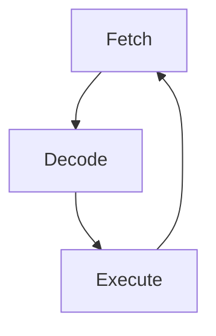
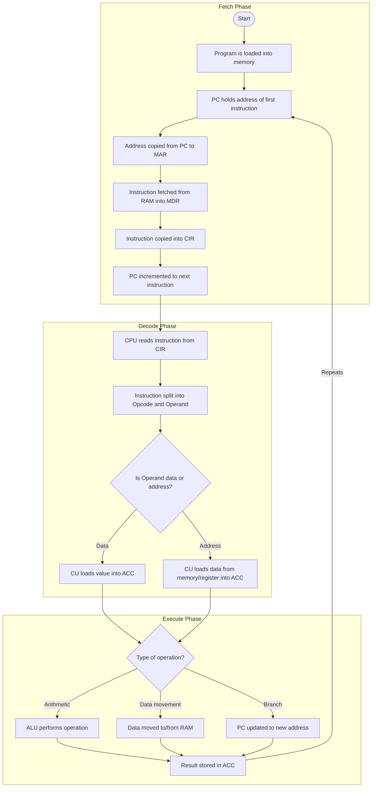

# CPU and Registers

> [!IMPORTANT]
> Possible covered areas related to CPU & Registers in Exam:
> - Key Components and Roles in CPU
> - Special Registers and Roles in FDE
> - FDE Cycle

Table of Contents

1. [Possible Covered Topics](#possible-covered-topics)
    - [Key Components and Roles in the CPU](#key-components-and-roles-in-the-cpu)
    - [Special Registers and Roles in FDE](#special-registers-and-roles-in-fde)
    - [FDE Cycle](#fde-cycle)
2. [Appendix](#appendix)
    - [All Components of CPU](#all-components-of-cpu)
    - [FDE Cycle Overview](#fde-cycle-overview)

***

## Possible Covered Topics

### Key Components and Roles in the CPU

> [!NOTE]
> CPU is the electronic circuit responsible for executing the instructions of a computer program. The CPU contains the ALU, CU, and a variety of Registers.

| Key Component | Role |
| ------------- | ----- |
| Central Processing Unit (CPU) | Executes instructions and processes data. |
| Arithmetic Logic Unit (ALU) | Performs arithmetic and logical operations. |
| Control Unit (CU) | Directs operations of the CPU and manages the Fetch-Decode-Execute cycle. |
| Registers | Small extreme fast storage location inside the CPU that hold specific data for immediate data processing. |

### Special Registers and Roles in FDE

> [!NOTE]
> To perform the [Fetch-Decode-Execute Cycle (FDE cycle)](#fde-cycle) properly, the CPU contains a number of specialised registers.

| Special Registers | Role | Role in FDE |
| ----------------- | ---- | ----------- |
| Program Counter (PC) | Holds the address of the next instruction to be fetched. | **During Fetch**: The PC sends this address to the <ins>Memory Address Register (MAR)</ins>. **After Fetch**: It increments to point to point to the next instruction in sequence |
| Memory Address Register (MAR) | Stores the address of data or instructions being accessed in memory. | **During Fetch**: Receives the address from the PC and sends it to memory to retrieve the instruction. |
| Memory Data Register (MDR) | Temporarily holds data fetched from or to be written to memory. | **During Fetch**: It receives the instruction from memory and passes it to the <ins>Current Instruction Register (CIR)</ins>. |
| Current Instruction Register (CIR) | Holds the instruction currently being decoded and executed. | **During Decode**: The instruction in the CIR is interpreted by the <ins>Control Unit</ins>, which then signals the necessary components to carry it out. |
| Accumulator (ACC) | Holds intermediate results of arithmetic and logic operations performed by the ALU. | **During Execute**: The ALU uses the ACC to perform operations like addition, subtraction, etc. and stores the result back in the ACC. |

### FDE Cycle

> [!NOTE]
> Instructions are processed using a process known as the Fetch-Decode-Execute (FDE cycle). The cycle repeats continuously whist the computer is running a program. There are 3 stages: [Fetching](#fetch), [Decoding](#decode), and [Executing](#execute).

> [!TIP]
> See [FDE Cycle Overview](#fde-cycle-overview) for complete diagram.

#### Fetch

> [!NOTE]
> **Fetch**: Receives an instruction from memory.

1. Program is loaded  into memory.
2. PC holds address of first instruction.
3. Address copied from PC to MAR.
4. Instruction fetched from RAM into MDR.
5. Instruction copied into CIR.
6. PC incremented to next instruction.

#### Decode

> [!NOTE]
> **Decode**: Interpret the instruction, read, then retrieve the required data from their addresses.

7. CPU reads instruction from CIR.
8. Instruction split into Opcode (Operation Code) and Operand (Data/Memory Address).
9. If the operand is data, then CU loads the value directly into the ACC.
10. If the operand is a memory address/register, the CU loads the data from that location and stores it in the ACC.

#### Execute

> [!NOTE]
> **Execute**: CPU carries out the required action.

11. If the operation is arithmetic (e.g. `ADD`, `SUB`), the ALU performs the operation.
12. If the operation is a data movement (e.g. `LOAD`, `STORE`), the data is transformed to/from RAM.
13. If the instruction is a branch (e.g. `JUMP`), the PC is updated to a new address.
14. The result of the operation is stored in the ACC.
15. The cycle repeats.

## Appendix

### All Components of CPU

| Component                          | Definition                                                                |
|------------------------------------|---------------------------------------------------------------------------|
| Central Processing Unit (CPU)      | Executes instructions and processes data.                                 |
| Arithmetic Logic Unit (ALU)        | Performs arithmetic and logical operations.                               |
| Control Unit (CU)                  | Directs operations of the CPU and manages the Fetch-Decode-Execute cycle. |
| Clock                              | Synchronizes the CPU’s operations, measured in Hertz (Hz).                |
| Floating-point Unit (FPU)          | Handles calculations involving decimal numbers.                           |
| Bus Interface                      | Manages communication between the CPU and other components.               |
| Address Bus                        | Carries memory addresses between the CPU and RAM.                         |
| Data Bus                           | Transfers actual data between CPU, memory, and I/O devices.               |
| Control Bus                        | Sends control signals to manage operations like read/write.               |
| Fetch-Decode-Execute Cycle         | The process of retrieving, understanding, and carrying out instructions.  |
| Program Counter (PC)               | Holds the address of the next instruction to be fetched.                  |
| Memory Address Register (MAR)      | Stores the address of data or instructions being accessed in memory.      |
| Memory Data Register (MDR)         | Temporarily holds data fetched from or to be written to memory.           |
| Current Instruction Register (CIR) | Holds the instruction currently being executed.                           |
| Accumulator (ACC)                  | Holds intermediate results of calculations performed by the ALU.          |

### FDE Cycle Overview

> [!TIP]
> The diagram is interactive because of [Mermaid](https://mermaid.js.org/)! Feel free to zoom-in and zoom-out as you needed.

Diagram produced via [mermaid](https://docs.github.com/en/get-started/writing-on-github/working-with-advanced-formatting/creating-diagrams).
